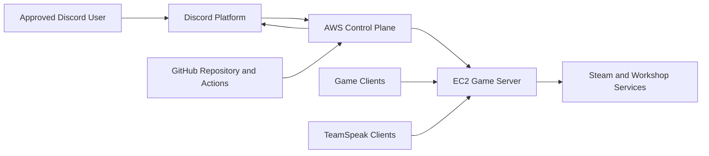
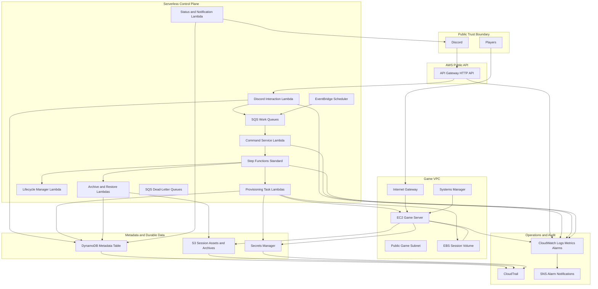
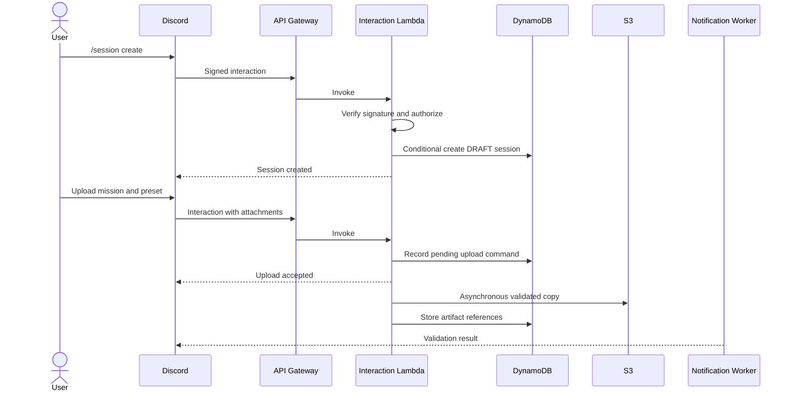
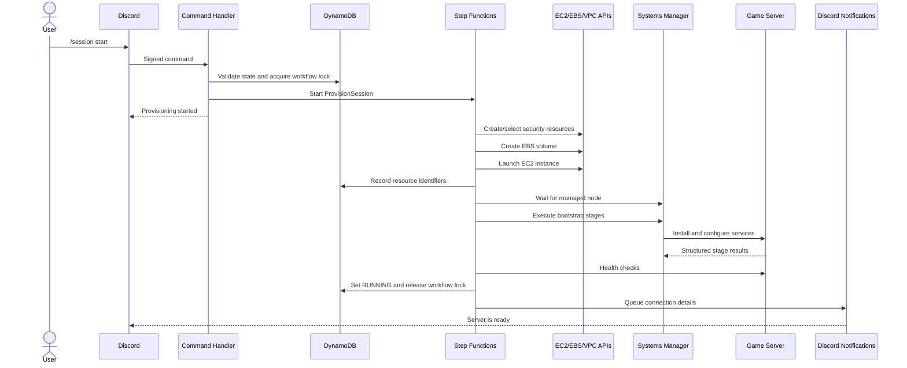

!!! The file may be outdated. Do not use as source of truth. It can provide extra context from initial plan !!!
---
title: Game Server Platform — Target-State Technical Architecture
document_type: canonical end-state architecture specification
status: target architecture
version: 1.0
last_updated: 2026-08-02
project: game-server-platform
repository_host: GitHub
primary_language: Go
cloud_provider: AWS
default_region: us-west-2
infrastructure_as_code: Terraform
primary_interface: Discord application commands
intended_audience:
  - software engineers
  - cloud engineers
  - security reviewers
  - operators
  - future maintainers
  - LLM-based coding assistants
sensitive_information_policy:
  account_ids: omitted
  credentials: never included
  secret_values: never included
  personal_identifiers: omitted
---

# Game Server Platform — Target-State Technical Architecture

## 1. Document Purpose

This document defines the intended completed architecture of `game-server-platform`.

It is the canonical technical specification for the system after all major implementation phases are complete. It describes the end-state platform rather than only the components currently implemented. It is designed to be usable by human engineers and by LLM-based coding assistants that need a durable reference for implementation decisions, system boundaries, invariants, naming, workflows, data contracts, and operational expectations.

This document should be updated whenever an architectural decision changes. Source code, Terraform, tests, runbooks, and deployed infrastructure must remain consistent with this specification.

The system is an on-demand game-server control platform. Its first supported game is Arma 3, but the control-plane abstractions remain game-neutral so additional dedicated-server games can be added without replacing the orchestration platform.

---

## 2. Executive Summary

The completed platform allows approved Discord users to create, configure, start, monitor, stop, archive, restore, and delete dedicated game-server sessions.

The platform uses a serverless AWS control plane and disposable EC2 compute:

- Discord is the user interface.
- Amazon API Gateway receives Discord interaction webhooks.
- Go-based AWS Lambda functions authenticate and validate commands.
- AWS Step Functions Standard workflows orchestrate long-running, resumable lifecycle operations.
- Amazon EventBridge Scheduler creates one-time and recurring lifecycle checks.
- Amazon DynamoDB stores authoritative session metadata, workflow state, event history, idempotency records, and scheduled-action indexes.
- Amazon S3 stores mission files, presets, configuration artifacts, logs, and archives.
- Amazon EC2 runs the dedicated game server and optional TeamSpeak service.
- Amazon EBS provides active high-performance session storage.
- AWS Systems Manager provides administrative access and remote execution without inbound SSH.
- AWS Secrets Manager stores Discord, Steam, TeamSpeak, and other sensitive credentials.
- Amazon SQS buffers asynchronous work and provides dead-letter queues for failed deliveries.
- Amazon CloudWatch and AWS CloudTrail provide logs, metrics, alarms, and audit history.
- Terraform defines all AWS infrastructure.
- GitHub Actions validates, packages, plans, and deploys through short-lived AWS credentials obtained using GitHub OIDC.

The lifecycle is optimized around three cost modes:

1. **Active** — EC2 and EBS are running.
2. **Sleeping** — EC2 is stopped; EBS remains for rapid wake-up.
3. **Archived** — EC2 and active EBS are deleted; durable metadata and S3 artifacts remain.

The platform treats infrastructure as disposable. Session identity and recoverability are based on metadata and durable artifacts, not on the continued existence of a specific virtual machine.

---

## 3. Goals

The completed system must:

1. Provision a playable game server without manual AWS console work.
2. Allow session management through Discord application commands.
3. Preserve session identity and recoverable data after compute is destroyed.
4. Resume interrupted workflows from the last safely completed stage.
5. Prevent duplicate commands from provisioning duplicate infrastructure.
6. Minimize idle cost through automatic sleep and archival.
7. Provide structured status, progress, warnings, and errors in Discord.
8. Use least-privilege AWS roles for runtime components.
9. Avoid permanent AWS credentials in developer machines and GitHub.
10. Produce sufficient telemetry to troubleshoot the platform without direct server access.
11. Support Arma 3 first while retaining game-neutral platform terminology.
12. Permit additional games through adapter implementations rather than control-plane rewrites.
13. Make destructive operations explicit, auditable, and recoverable where practical.
14. Keep all cloud resources reproducible through Terraform and version-controlled configuration.

---

## 4. Non-Goals

The initial completed platform is not intended to be:

- a public multi-tenant commercial hosting service;
- a general Kubernetes platform;
- a real-time game relay or proxy;
- a matchmaking service;
- a replacement for Steam authentication;
- a permanent high-availability game cluster;
- a system that live-migrates an active game process;
- a full web administration portal;
- a billing system for external customers;
- a distributed database for game state;
- an unattended platform that can exceed configured spending limits without alarms.

A web dashboard, customer billing, multi-region active-active operation, multiple AWS accounts, and additional games are future extensions.

---

## 5. Core Architectural Principles

### 5.1 Infrastructure is disposable

EC2 instances, network interfaces, public addresses, and active EBS volumes are runtime resources. None is the authoritative identity of a session.

### 5.2 Metadata is authoritative

DynamoDB is the system of record for:

- session identity;
- ownership;
- desired and observed lifecycle state;
- resource identifiers;
- workflow execution identifiers;
- configuration references;
- archive references;
- scheduling data;
- lifecycle history.

### 5.3 Durable artifacts are external to compute

Mission files, launcher presets, archives, logs, generated configuration, and other durable assets are stored in S3.

### 5.4 Workflows are resumable and idempotent

Every provisioning and bootstrap stage must be safely repeatable or must detect that its desired result already exists.

### 5.5 Commands acknowledge quickly

Discord-facing request handlers perform authentication, validation, authorization, and enqueueing. Long-running work occurs asynchronously.

### 5.6 Runtime credentials are temporary

AWS workloads use IAM roles. GitHub uses OIDC. Developers use temporary authenticated profiles. Long-lived AWS access keys are not part of the target architecture.

### 5.7 Security boundaries are explicit

Discord, the public API endpoint, the AWS control plane, the game-server subnet, S3, DynamoDB, and Secrets Manager are separate trust zones with narrowly defined access.

### 5.8 The platform reconciles desired and observed state

Commands express a desired state. Workers observe the actual AWS and server state and converge toward the desired state.

### 5.9 Cost is a lifecycle concern

The lifecycle manager is responsible for moving sessions from active to sleeping to archived based on policy and player activity.

### 5.10 Game-specific behavior is isolated

Arma-specific installation, validation, ports, files, mods, health checks, and archival logic live behind a game adapter.

---

## 6. Key Architectural Decisions

| Area | Decision |
|---|---|
| Cloud | AWS |
| Primary Region | `us-west-2`, configurable by environment |
| Control-plane language | Go |
| Discord library | `discordgo` |
| Public interaction endpoint | API Gateway HTTP API to Lambda |
| Workflow orchestration | AWS Step Functions Standard |
| Asynchronous queues | Amazon SQS |
| Schedules | Amazon EventBridge Scheduler |
| Metadata database | Amazon DynamoDB |
| Long-term object storage | Amazon S3 |
| Active block storage | Amazon EBS |
| Compute | On-demand Amazon EC2 |
| Administrative host access | AWS Systems Manager Session Manager and Run Command |
| Secrets | AWS Secrets Manager |
| Logs and metrics | Amazon CloudWatch |
| Audit | AWS CloudTrail |
| DNS | Amazon Route 53, when a stable hostname is required |
| Infrastructure as code | Terraform |
| Bootstrap | Cloud-init plus versioned Bash scripts and a small platform agent |
| CI/CD | GitHub Actions |
| GitHub-to-AWS authentication | GitHub OIDC to IAM roles |
| Developer AWS authentication | Temporary browser-authenticated AWS CLI profiles |
| Production database decision | DynamoDB, not SQLite |
| Local testing database | In-memory repositories; SQLite is optional and non-authoritative |
| Primary source control | GitHub |
| Default deployment model | One AWS account and one primary Region initially; environments separated by naming, state, and IAM |

### 6.1 Why DynamoDB replaces deployed SQLite

AWS Lambda local writable storage is temporary and isolated to an execution environment. A SQLite file inside Lambda cannot serve as the shared durable control-plane database.

DynamoDB provides a serverless shared metadata store that is independent of Lambda execution environments and EC2 lifecycle. Application code accesses metadata through interfaces so local tests can use in-memory or optional SQLite implementations.

### 6.2 Why Step Functions is included

The target system requires long-running, multi-stage, resumable, observable workflows. Step Functions Standard provides durable workflow execution, retries, timeouts, branching, parallel work, and execution history. It prevents the application from implementing an ad hoc workflow engine entirely inside Lambda and DynamoDB.

DynamoDB still records business state and platform history. Step Functions records orchestration execution.

### 6.3 Why EC2 is placed in a public subnet

The game server must accept public player traffic and download Steam/Workshop content. A public subnet with a restrictive security group avoids a continuously billed NAT Gateway. Administrative access does not use public SSH; it uses Systems Manager.

### 6.4 Why public IP is not treated as identity

A stopped and restarted EC2 instance can receive a different automatically assigned public IPv4 address. The platform stores the current address as observed state and updates Discord and optional Route 53 records after wake-up.

---

## 7. System Context



### 7.1 External actors

- **Session owner** — creates and controls sessions.
- **Approved player** — views connection details and joins running servers.
- **Platform administrator** — manages AWS, Terraform, secrets, policies, and incidents.
- **Discord** — sends interactions and receives responses.
- **Steam/Workshop** — supplies server binaries, DLC, and mod content.
- **GitHub** — hosts source code and invokes CI/CD workflows.
- **AWS** — provides control-plane and compute services.

---

## 8. High-Level AWS Architecture



---

## 9. AWS Account and Environment Structure

### 9.1 Initial account model

The first complete implementation may operate in a single secured AWS account. The account contains separate logical environments:

- `dev`
- `staging`, optional before production launch
- `prod`

Each environment has:

- a separate Terraform state key;
- distinct resource names;
- distinct S3 prefixes or buckets;
- distinct DynamoDB tables;
- distinct Lambda functions;
- distinct Step Functions state machines;
- distinct Secrets Manager secret paths;
- distinct IAM deployment and runtime roles.

### 9.2 Recommended mature account model

When the project becomes operationally important, migrate to AWS Organizations with separate accounts:

- management/security account;
- shared services account;
- development account;
- production account;
- optional log archive account.

Cross-account deployment uses GitHub OIDC roles. Production data and permissions must not be shared with development.

### 9.3 Region strategy

The initial home Region is `us-west-2`.

Region selection for a game session is an environment or game-profile decision based on:

- player latency;
- required EC2 instance availability;
- cost;
- Steam download behavior;
- game compatibility;
- legal or organizational requirements.

The first release supports one Region per environment. Multi-region sessions are a later extension.

### 9.4 Resource tags

All taggable resources must include:

```text
Project=game-server-platform
Environment=<dev|staging|prod>
ManagedBy=Terraform
Component=<component-name>
Owner=<team-or-role>
CostCenter=<configured-value>
DataClassification=<public|internal|confidential>
```

Per-session resources additionally include:

```text
SessionId=<ULID>
GameType=<game-type>
LifecycleState=<state>
ExpiresAt=<RFC3339 timestamp when applicable>
```

Tags support cost reporting, incident response, reconciliation, and orphan cleanup. Tags are not the authoritative lifecycle database.

---

## 10. Network Architecture

### 10.1 VPC

Each environment has a dedicated VPC.

Example development CIDR:

```text
10.40.0.0/16
```

The exact CIDR is configurable and must not overlap networks used for future peering or VPN connections.

### 10.2 Subnets

Initial topology:

- two public subnets across two Availability Zones;
- game-server EC2 instances launch in one selected public subnet;
- EBS volumes are created in the same Availability Zone as the instance;
- no NAT Gateway in the baseline architecture.

Two subnets allow availability-zone selection and future expansion. A single game session remains single-instance and single-AZ.

### 10.3 Internet connectivity

The VPC contains an Internet Gateway. Game instances receive:

- a private IPv4 address;
- a public IPv4 address while running;
- outbound internet access for Steam, Workshop, package repositories, and service updates.

The public address is runtime state. It can change after stop/start.

### 10.4 Route tables

Public subnets use a route table containing:

```text
0.0.0.0/0 -> Internet Gateway
```

IPv6 is optional and disabled until game compatibility and security rules are validated.

### 10.5 Security groups

Each game session receives or references a game-profile security group.

Inbound rules are narrowly scoped to required game and voice ports. For Arma 3, the exact port set is configuration-driven; a typical profile includes a small contiguous UDP range around the configured game port.

Example only:

| Purpose | Protocol | Port | Source |
|---|---:|---:|---|
| Arma game traffic | UDP | 2302-2306 | approved player CIDRs or `0.0.0.0/0` when required |
| TeamSpeak voice | UDP | 9987 | approved player CIDRs or configured public range |
| TeamSpeak ServerQuery | TCP | 10011 or configured secure query port | administrator CIDRs only, preferably disabled publicly |
| TeamSpeak file transfer | TCP | 30033 | only if required |
| SSH | TCP | 22 | no inbound rule |

Security group egress is initially allowed to the internet. It can later be narrowed using managed prefix lists, VPC endpoints, or an egress proxy if operationally justified.

### 10.6 Administrative access

No routine inbound SSH is permitted.

Administration uses:

- AWS Systems Manager Session Manager;
- Systems Manager Run Command;
- CloudWatch logs;
- S3 log uploads;
- automated diagnostic bundles.

The EC2 instance role includes the minimum Systems Manager managed-instance permissions and project-specific S3, Secrets Manager, DynamoDB, and CloudWatch permissions.

### 10.7 DNS

Optional Route 53 records provide a stable session hostname:

```text
<session-slug>.<environment>.<managed-domain>
```

The lifecycle manager updates the `A` record after provisioning or wake-up and removes or marks it unavailable after sleep/archive.

DNS is a convenience. The authoritative current endpoint remains the session record in DynamoDB.

---

## 11. Control Plane

## 11.1 Discord Application

Discord is the primary user interface.

The application uses slash commands, buttons, select menus, modals, embeds, and attachment options. Commands are registered per development guild during development and globally for production when stable.

Initial command set:

| Command | Purpose |
|---|---|
| `/session create` | Create a draft session |
| `/session configure` | Set game profile and options |
| `/session upload-mission` | Attach a mission file |
| `/session upload-preset` | Attach a launcher preset |
| `/session start` | Provision or wake a session |
| `/session status` | Show lifecycle, workflow, endpoint, and health |
| `/session list` | List accessible sessions |
| `/session stop` | Gracefully stop and sleep a session |
| `/session wake` | Start a sleeping session |
| `/session archive` | Archive and destroy active infrastructure |
| `/session restore` | Restore an archived session |
| `/session delete` | Permanently delete metadata and retained artifacts according to policy |
| `/session logs` | Retrieve a diagnostic summary or signed log link |
| `/session cancel` | Request cancellation of a cancellable workflow |
| `/rb admin` | Open a protected component menu for implemented administration actions |

Permissions are based on Discord guild, role, channel, user identity, and session ownership.

### 11.1.1 Interaction security

Every HTTP interaction request must:

1. preserve the raw request body;
2. validate the Discord signature and timestamp;
3. reject stale or invalid signatures;
4. validate the application and guild context;
5. enforce a maximum request size;
6. produce a correlation ID;
7. log security-relevant failures without logging tokens or attachments.

The interaction handler responds synchronously only when work is immediately available. Long-running commands return a deferred or accepted response and complete through a follow-up message.

### 11.1.2 Discord token handling

- Discord bot tokens are stored only in Secrets Manager.
- Discord public verification keys may be stored as non-secret configuration, but keeping them in a managed configuration path is acceptable.
- Interaction tokens are short-lived operational values and must never be persisted in logs.
- Follow-up notifications use the bot token or the interaction webhook token according to the command flow.
- Secret values are cached only within a Lambda execution environment for a short bounded period.

---

## 11.2 API Gateway

Amazon API Gateway HTTP API exposes the Discord interaction endpoint.

Example route:

```text
POST /discord/interactions
```

Responsibilities:

- TLS termination;
- request routing;
- request-size enforcement;
- access logging;
- throttling;
- optional AWS WAF attachment if supported and justified;
- Lambda invocation.

API Gateway does not perform Discord signature validation. The Lambda handler validates the signature against the exact raw body.

The API has no general-purpose public administrative endpoints in the baseline release. Future web or CLI APIs use separate routes, authorization, and scopes.

---

## 11.3 Interaction Lambda

The Discord Interaction Lambda is intentionally small and latency-sensitive.

Responsibilities:

1. verify Discord request signatures;
2. parse interaction type;
3. respond to endpoint verification requests;
4. validate command shape;
5. resolve actor, guild, channel, and role context;
6. perform preliminary authorization;
7. generate an idempotency key;
8. record the command request;
9. enqueue asynchronous work or start a workflow;
10. return an immediate Discord response.

It must not:

- create EC2 instances directly;
- wait for Steam downloads;
- execute archive compression;
- poll game health in a request loop;
- contain game-specific installation logic.

---

## 11.4 Command Service

The Command Service normalizes Discord requests into internal commands.

Canonical command envelope:

```json
{
  "command_id": "01JEXAMPLEULID",
  "command_type": "StartSession",
  "requested_at": "2026-08-02T20:00:00Z",
  "actor": {
    "discord_user_id": "string",
    "guild_id": "string",
    "channel_id": "string",
    "roles": ["string"]
  },
  "session_id": "01JSESSIONULID",
  "idempotency_key": "discord:<interaction-id>",
  "correlation_id": "01JCORRELATIONULID",
  "parameters": {}
}
```

Command processing:

1. read the existing session;
2. perform full authorization;
3. validate command against current state;
4. conditionally update desired state;
5. append a domain event;
6. start or signal the appropriate workflow;
7. create a notification request;
8. return without waiting for workflow completion.

---

## 11.5 Step Functions Workflows

Use Step Functions Standard workflows for lifecycle operations that can run for minutes or hours.

Canonical state machines:

- `ProvisionSession`
- `BootstrapGameServer`
- `SleepSession`
- `WakeSession`
- `ArchiveSession`
- `RestoreSession`
- `DestroySession`
- `ReconcileSession`
- `RotateOrUpdateWorkshopContent`, future

Each workflow receives:

```json
{
  "session_id": "01JSESSIONULID",
  "workflow_id": "01JWORKFLOWULID",
  "requested_by": "discord-user-id-or-system",
  "correlation_id": "01JCORRELATIONULID",
  "expected_session_version": 12
}
```

Workflow tasks must:

- have explicit timeouts;
- use bounded retries with exponential backoff and jitter where supported;
- distinguish retryable from terminal errors;
- write stage status to DynamoDB;
- emit structured events;
- use compensating cleanup for partially created resources;
- finish with a terminal workflow result;
- never silently ignore a failed cleanup.

### 11.5.1 Workflow concurrency

Only one infrastructure-mutating workflow may hold the session workflow lock at a time.

The lock is represented by a conditional DynamoDB update containing:

```text
active_workflow_id
active_workflow_type
active_workflow_started_at
active_workflow_lease_expires_at
```

A Step Functions execution ARN alone is not sufficient as a lock because duplicate requests can race before execution creation.

### 11.5.2 Workflow cancellation

Cancellation is cooperative.

A cancel request sets:

```text
cancel_requested_at
cancel_requested_by
```

Tasks check the flag at safe boundaries. Destructive or consistency-critical stages may finish before cancellation is honored.

---

## 11.6 Lambda Task Functions

Prefer small functions organized by bounded responsibility rather than one large function.

Logical task groups:

- session command handlers;
- infrastructure discovery;
- EC2 create/start/stop/terminate;
- EBS create/attach/detach/delete;
- security group and network configuration;
- instance readiness checks;
- SSM command dispatch and status polling;
- S3 artifact validation and movement;
- secret retrieval and validation;
- Discord notifications;
- health evaluation;
- archive coordination;
- orphan reconciliation.

Multiple related handlers may share one deployable package if cold-start, IAM, and ownership boundaries remain clear.

Runtime functions use the AWS SDK for Go v2.

---

## 11.7 SQS Queues and Dead-Letter Queues

SQS decouples request ingestion and background processing.

Recommended queues:

| Queue | Purpose |
|---|---|
| `commands` | normalized asynchronous commands |
| `notifications` | Discord messages and updates |
| `health-events` | server health observations |
| `reconciliation` | scheduled or manually requested reconciliation |
| `archive-events` | archive completion and transfer events |
| `command-dlq` | failed command messages |
| `notification-dlq` | failed Discord delivery messages |
| `health-dlq` | malformed or repeatedly failing health events |

Queue consumers use:

- explicit visibility timeouts;
- partial batch response where applicable;
- idempotency records;
- bounded receive counts;
- DLQ alarms.

Messages contain references, not large binary content. Files remain in S3.

---

## 11.8 EventBridge Scheduler

EventBridge Scheduler manages:

- idle checks;
- warning notifications;
- archival deadlines;
- one-time wake schedules;
- cleanup retries;
- reconciliation intervals;
- archive retention actions;
- optional scheduled server starts.

Per-session one-time schedules are named using session and action identifiers.

Example:

```text
game-server-platform-prod-session-01J...-warning-1
```

Every schedule targets SQS or a Lambda function through a narrowly scoped scheduler execution role.

Schedules use:

- dead-letter queues;
- retry policies;
- explicit deletion after completion where appropriate;
- UTC timestamps internally;
- user-facing timezone conversion at the interface boundary.

DynamoDB remains the authoritative statement of whether a scheduled action is still applicable. A late or duplicated scheduled invocation must be harmless.

---

## 12. Metadata Layer

## 12.1 DynamoDB Table

Each environment uses one primary DynamoDB table:

```text
game-server-platform-<environment>-metadata
```

Baseline configuration:

- billing mode: on-demand;
- partition key: `pk`;
- sort key: `sk`;
- point-in-time recovery: enabled;
- server-side encryption: enabled;
- deletion protection: enabled in production;
- DynamoDB Streams: enabled when event-driven projections are needed;
- TTL attribute: `expires_at_epoch` for disposable idempotency and lock records;
- table class: standard unless access patterns justify otherwise.

### 12.1.1 Common attributes

```text
pk
sk
entity_type
schema_version
created_at
updated_at
version
correlation_id
```

`version` supports optimistic concurrency. Updates to mutable business records use conditional expressions.

---

## 12.2 Identifier Strategy

Use ULIDs for platform-generated identifiers because they are globally unique and lexically sortable by creation time.

Examples:

```text
session_id: 01J...
workflow_id: 01J...
event_id: 01J...
command_id: 01J...
archive_id: 01J...
```

External Discord and AWS identifiers remain strings.

User-facing session slugs are separate from primary identifiers and need not be globally immutable.

---

## 12.3 Session Record

Primary key:

```text
pk = SESSION#<session_id>
sk = METADATA
```

Representative schema:

```json
{
  "pk": "SESSION#01JSESSION",
  "sk": "METADATA",
  "entity_type": "Session",
  "schema_version": 1,
  "session_id": "01JSESSION",
  "slug": "saturday-arma",
  "display_name": "Saturday Arma",
  "game_type": "arma3",
  "owner_discord_user_id": "123",
  "guild_id": "456",
  "channel_id": "789",
  "allowed_role_ids": ["999"],
  "desired_state": "RUNNING",
  "observed_state": "RUNNING",
  "lifecycle_state": "RUNNING",
  "health_status": "HEALTHY",
  "version": 18,
  "game_profile_id": "arma3-default",
  "mission_object_key": "sessions/01JSESSION/input/mission/example.pbo",
  "preset_object_key": "sessions/01JSESSION/input/presets/launcher.html",
  "archive_id": null,
  "instance_id": "i-example",
  "volume_id": "vol-example",
  "availability_zone": "us-west-2a",
  "private_ip": "10.40.1.50",
  "public_ip": "203.0.113.10",
  "hostname": "saturday-arma.prod.example.com",
  "player_count": 4,
  "last_player_seen_at": "2026-08-02T19:45:00Z",
  "idle_since": null,
  "sleep_after_seconds": 1800,
  "archive_after_seconds": 604800,
  "active_workflow_id": null,
  "last_error_code": null,
  "last_error_message": null,
  "created_at": "2026-08-01T01:00:00Z",
  "updated_at": "2026-08-02T20:00:00Z"
}
```

The AWS resource IDs in this example are illustrative and never hard-coded.

---

## 12.4 Session Configuration Record

```text
pk = SESSION#<session_id>
sk = CONFIG#CURRENT
```

Contains normalized, validated configuration:

```json
{
  "game": {
    "type": "arma3",
    "server_name": "Saturday Arma",
    "max_players": 20,
    "password_secret_ref": "/game-server-platform/prod/session/01J.../game-password",
    "admin_password_secret_ref": "/game-server-platform/prod/session/01J.../admin-password"
  },
  "compute": {
    "instance_profile": "arma3-balanced",
    "volume_size_gib": 150,
    "volume_type": "gp3",
    "region": "us-west-2"
  },
  "features": {
    "teamspeak_enabled": true,
    "battleye_enabled": true
  },
  "content": {
    "workshop_collection_id": "string",
    "creator_dlc": ["string"],
    "mission_object_key": "string",
    "preset_object_key": "string"
  },
  "policy": {
    "sleep_after_seconds": 1800,
    "archive_after_seconds": 604800,
    "warning_offsets_seconds": [86400, 3600]
  }
}
```

Configuration updates create immutable revisions:

```text
sk = CONFIG#<revision-number>
```

`CONFIG#CURRENT` points to or contains the active revision.

---

## 12.5 Workflow Records

Workflow summary:

```text
pk = SESSION#<session_id>
sk = WORKFLOW#<workflow_id>
```

Stage record:

```text
pk = SESSION#<session_id>
sk = WORKFLOW#<workflow_id>#STAGE#<stage-name>
```

Stage fields:

```text
status
attempt
started_at
completed_at
input_hash
result_summary
error_code
error_message
step_functions_execution_arn
```

Never store credentials, complete command output, or large logs in DynamoDB. Store logs in CloudWatch or S3 and persist references.

---

## 12.6 Event History

```text
pk = SESSION#<session_id>
sk = EVENT#<timestamp>#<event_id>
```

Event example:

```json
{
  "event_id": "01JEVENT",
  "event_type": "InstanceCreated",
  "occurred_at": "2026-08-02T20:10:00Z",
  "actor_type": "system",
  "actor_id": "ProvisionSession",
  "correlation_id": "01JCORRELATION",
  "workflow_id": "01JWORKFLOW",
  "data": {
    "instance_id": "i-example",
    "availability_zone": "us-west-2a"
  }
}
```

Events are append-only. Corrections are represented by new events.

---

## 12.7 Idempotency Records

```text
pk = IDEMPOTENCY#<idempotency-key>
sk = RESULT
```

Fields:

```text
request_hash
status
created_at
completed_at
result_reference
expires_at_epoch
```

Rules:

- the same key and same request hash returns the original result;
- the same key with a different request hash is rejected;
- pending keys prevent concurrent duplicate processing;
- TTL removes old records after the configured retention period.

---

## 12.8 Global Secondary Indexes

### GSI1 — Sessions by owner or guild

```text
gsi1pk = OWNER#<discord-user-id>
gsi1sk = UPDATED#<timestamp>#SESSION#<session-id>
```

or:

```text
gsi1pk = GUILD#<guild-id>
gsi1sk = STATE#<state>#UPDATED#<timestamp>#SESSION#<session-id>
```

The exact projection is chosen based on measured access patterns. Avoid overloading one index with incompatible query requirements.

### GSI2 — Sessions by lifecycle state

```text
gsi2pk = STATE#<lifecycle-state>
gsi2sk = UPDATED#<timestamp>#SESSION#<session-id>
```

Used by administrative lists and reconciliation.

### GSI3 — Due actions

```text
gsi3pk = DUE#<action-type>#<date-bucket>
gsi3sk = <due-timestamp>#SESSION#<session-id>
```

This supports reconciliation of schedules and overdue actions. EventBridge Scheduler remains the primary timer mechanism.

---

## 12.9 Repository Interface

Application business logic depends on interfaces, not DynamoDB SDK calls.

Example conceptual Go interface:

```go
type SessionRepository interface {
    Create(ctx context.Context, session Session) error
    Get(ctx context.Context, sessionID string) (Session, error)
    Update(ctx context.Context, session Session, expectedVersion int64) error
    ListByOwner(ctx context.Context, ownerID string, page Page) (SessionPage, error)
    AppendEvent(ctx context.Context, event SessionEvent) error
    AcquireWorkflowLock(ctx context.Context, lock WorkflowLock) error
    ReleaseWorkflowLock(ctx context.Context, sessionID, workflowID string) error
}
```

Infrastructure packages implement the interface using DynamoDB. Unit tests use an in-memory implementation.

---

## 13. Object Storage

## 13.1 S3 Buckets

At minimum, each environment has:

1. a Terraform state bucket;
2. a session assets bucket;
3. optionally a dedicated access-log or audit bucket.

Production may separate uploads, archives, and logs into different buckets if policies diverge.

Example bucket purpose:

```text
game-server-platform-<env>-assets-<unique-suffix>
```

Bucket names include a unique suffix and are not hard-coded in application logic.

### 13.1.1 Required controls

- all public access blocked;
- server-side encryption enabled;
- versioning enabled;
- bucket-owner-enforced object ownership;
- TLS required through bucket policy;
- lifecycle policies configured;
- access logging or CloudTrail data events enabled for sensitive prefixes as justified;
- production deletion protection implemented through Terraform lifecycle and IAM restrictions.

---

## 13.2 Object Key Layout

```text
sessions/
  <session-id>/
    input/
      missions/
        <content-hash>-<filename>.pbo
      presets/
        <content-hash>-<filename>
      configs/
        <revision>.json
    generated/
      server/
        <revision>/
          server.cfg
          basic.cfg
          mods.list
          launch.sh
      manifests/
        <revision>.json
    runtime/
      reports/
        <timestamp>.json
      diagnostics/
        <timestamp>.tar.zst
    logs/
      arma/
        <date>/<object>
      teamspeak/
        <date>/<object>
      bootstrap/
        <workflow-id>/<stage>.log.gz
    archives/
      <archive-id>/
        manifest.json
        session-data.tar.zst
        checksums.sha256
```

Keys must not contain secrets.

---

## 13.3 Upload Flow

Discord attachments are not streamed through long-running Lambda processing.

Flow:

1. Discord interaction supplies attachment metadata and a temporary source URL.
2. Interaction handler validates declared type, name, and size.
3. An asynchronous worker downloads the object with strict timeouts and size limits.
4. The worker computes a SHA-256 digest.
5. The worker validates the file format.
6. The worker uploads to an isolated S3 input prefix.
7. Optional malware scanning or content validation occurs.
8. The metadata record is updated only after successful validation.
9. Failed objects remain quarantined or are deleted according to policy.

For future web uploads, the platform can issue short-lived presigned S3 upload URLs.

---

## 13.4 Validation

### Mission files

Validate:

- permitted extension;
- maximum size;
- non-empty content;
- archive/container structure when applicable;
- safe filename;
- expected game profile;
- no path traversal when extracted;
- content hash.

### Launcher presets

Validate:

- permitted file type;
- schema or HTML/XML structure;
- maximum number of referenced mods;
- Workshop ID syntax;
- duplicate references;
- unsupported local-mod paths.

### Archives

Validate:

- manifest schema;
- archive format;
- checksum file;
- expected session and archive IDs;
- uncompressed-size limit;
- path traversal protection;
- required content presence.

---

## 13.5 Lifecycle Policies

Example policies:

- incomplete multipart uploads: abort after 7 days;
- transient diagnostics: expire after 30 days;
- ordinary logs: transition to lower-cost storage after 30-90 days and expire according to policy;
- archived session data: retain until user deletion or configured expiration;
- non-current versions: expire after a controlled recovery window;
- quarantine objects: expire after investigation period.

Lifecycle values are environment variables or Terraform configuration, not embedded in application code.

---

## 14. Secrets and Configuration

## 14.1 Secrets Manager Paths

Canonical path structure:

```text
/game-server-platform/<environment>/discord/bot-token
/game-server-platform/<environment>/steam/account
/game-server-platform/<environment>/teamspeak/license
/game-server-platform/<environment>/session/<session-id>/game-password
/game-server-platform/<environment>/session/<session-id>/admin-password
```

Steam secret example structure:

```json
{
  "username": "secret",
  "password": "secret",
  "shared_secret": "optional-secret",
  "identity_secret": "optional-secret"
}
```

Secret schemas are documented but values never appear in source, Terraform variables, state, logs, Discord, or DynamoDB.

### 14.1.1 Secret access

- interaction handlers can access only Discord verification and notification secrets they require;
- provisioning tasks can read only the Steam secret and session-specific references required for bootstrap;
- EC2 instance roles can read only explicitly tagged or named project secrets;
- secret write permissions belong to deployment or administrative roles, not normal runtime roles.

### 14.1.2 Rotation

Discord and Steam secrets that cannot be automatically rotated are rotated through an operational runbook. Session passwords can be regenerated per session or per restore.

---

## 14.2 Non-Secret Configuration

Use environment variables or a managed configuration object for:

```text
APP_ENV
AWS_REGION
LOG_LEVEL
METADATA_TABLE_NAME
ASSETS_BUCKET_NAME
COMMAND_QUEUE_URL
NOTIFICATION_QUEUE_URL
STATE_MACHINE_ARNS
DISCORD_APPLICATION_ID
DISCORD_PUBLIC_KEY
ALLOWED_GUILD_IDS
DEFAULT_GAME_PROFILE
DEFAULT_SLEEP_AFTER
DEFAULT_ARCHIVE_AFTER
ROUTE53_HOSTED_ZONE_ID
BASE_GAME_DOMAIN
```

Environment variables contain references and non-secret settings. Large configuration documents reside in S3 or DynamoDB.

---

## 15. Compute Plane

## 15.1 EC2 Instance

Each active session uses one on-demand EC2 instance.

Selection criteria:

- strong single-thread performance;
- sufficient memory for server, mods, and voice services;
- current-generation x86_64 compatibility unless ARM support is validated;
- EBS bandwidth;
- network performance;
- availability in the target Region;
- cost.

Instance type is selected through a named compute profile, not hard-coded in workflows.

Example profiles:

```text
arma3-small
arma3-balanced
arma3-large-modpack
```

Each profile defines:

```text
instance_types
fallback_instance_types
root_volume_size
data_volume_size
architecture
ami_parameter
cpu_credits_policy
network_ports
estimated_player_capacity
```

The provisioning workflow can try a bounded ordered set of compatible instance types if capacity is unavailable.

Spot Instances are not used for active gameplay in the baseline architecture because interruption would degrade the session. Spot may be considered for non-interactive tasks such as archive conversion or content prefetching.

---

## 15.2 AMI Strategy

Use a controlled Linux AMI selected from an SSM public parameter or a project-owned image pipeline.

AMI requirements:

- supported operating system;
- Systems Manager agent installed;
- cloud-init available;
- security updates;
- required filesystem and package tools;
- no embedded project credentials;
- IMDSv2 required;
- minimal unnecessary packages.

The AMI ID is resolved at deployment or launch time through a configured parameter, then recorded in the session workflow for reproducibility.

A future golden-image pipeline may preinstall SteamCMD and stable dependencies to reduce bootstrap duration.

---

## 15.3 EC2 Instance Profile

The instance role permits only:

- Systems Manager managed-instance communication;
- CloudWatch log and metric publishing;
- read access to the session's required S3 input/generated prefixes;
- write access to the session's logs/archive staging prefixes;
- read access to explicitly permitted secrets;
- limited DynamoDB update or event-publication access if the agent reports directly;
- KMS decrypt permissions only for required keys.

The role must not permit:

- broad IAM changes;
- arbitrary EC2 creation;
- unrestricted S3 access;
- deletion of Terraform state;
- reading unrelated environment secrets.

---

## 15.4 EBS Storage

### Root volume

The root volume contains the operating system and disposable bootstrap dependencies.

Properties:

- encrypted;
- delete on termination;
- sized to support package operations and temporary downloads;
- not considered an archive.

### Session data volume

A separate encrypted EBS volume stores:

- Arma server files;
- Workshop mods;
- Creator DLC;
- TeamSpeak files;
- runtime configuration;
- active mission state where applicable;
- cached content.

Properties:

- same Availability Zone as EC2;
- `gp3` baseline unless benchmarks justify another type;
- independently tagged;
- retained while session is sleeping;
- deleted after successful archival;
- delete-on-termination disabled until the workflow explicitly destroys it;
- filesystem UUID and mount point recorded;
- periodically checked for free space and filesystem health.

Default mount:

```text
/srv/game
```

A volume must be cleanly unmounted before detach or deletion when the instance is available.

---

## 15.5 Public Address and Connection Details

On launch or wake:

1. wait for EC2 running status;
2. wait for instance and system status checks;
3. retrieve the current public IPv4 address;
4. optionally update Route 53;
5. run application health checks;
6. publish current connection details to Discord.

On sleep:

1. stop application services;
2. flush and unmount as required;
3. shut down or stop EC2;
4. observe stopped state;
5. remove or update DNS;
6. clear the active public IP in metadata while retaining historical events.

---

## 15.6 Systems Manager

Systems Manager is the control channel for:

- bootstrap commands;
- service management;
- health probes;
- diagnostic collection;
- graceful shutdown;
- archive staging;
- emergency administrative sessions.

The instance must not be marked bootstrap-ready until it appears as a managed Systems Manager node.

SSM command output is bounded. Large logs are uploaded to CloudWatch or S3.

---

## 16. Game Adapter Architecture

## 16.1 Adapter Interface

Game-neutral lifecycle logic calls a game adapter.

Conceptual Go interface:

```go
type GameAdapter interface {
    Type() GameType
    ValidateConfiguration(ctx context.Context, cfg GameConfiguration) error
    BuildManifest(ctx context.Context, session Session) (InstallManifest, error)
    RequiredPorts(cfg GameConfiguration) []NetworkPort
    BootstrapStages(cfg GameConfiguration) []BootstrapStage
    HealthChecks(cfg GameConfiguration) []HealthCheck
    GracefulStopCommand(cfg GameConfiguration) RemoteCommand
    ArchivePlan(cfg GameConfiguration) ArchivePlan
    ConnectionDetails(session Session) ConnectionDetails
}
```

The first implementation is `Arma3Adapter`.

Future examples:

- Minecraft;
- Valheim;
- Factorio;
- other dedicated servers.

Game adapters cannot directly create AWS infrastructure. They return declarative requirements and remote commands to platform services.

---

## 16.2 Arma 3 Adapter

Responsibilities:

- validate `.pbo` mission assets;
- parse or normalize launcher presets;
- resolve Workshop content;
- identify Creator DLC requirements;
- generate server configuration;
- generate mod launch parameters;
- normalize Linux path case;
- define required ports;
- install/update Arma 3 Dedicated Server;
- start and stop the process;
- query player count and server responsiveness;
- collect relevant logs and profile data;
- define archive content.

The adapter must account for Linux case sensitivity and inconsistent mod file naming.

### 16.2.1 Workshop manifest

A normalized manifest includes:

```json
{
  "collection_id": "string",
  "items": [
    {
      "workshop_id": "123456789",
      "display_name": "Example Mod",
      "required": true,
      "load_order": 10,
      "content_hash": "optional"
    }
  ]
}
```

The manifest is immutable for a configuration revision. Updating Workshop content creates a new manifest revision.

### 16.2.2 Runtime service management

Use `systemd` units:

```text
game-platform-agent.service
arma3-server.service
teamspeak.service
```

Units specify:

- non-root service users;
- restart policies;
- resource limits;
- working directories;
- environment files with restricted permissions;
- log routing;
- dependency ordering.

---

## 16.3 TeamSpeak Adapter or Optional Feature

TeamSpeak runs alongside the game only when enabled.

Responsibilities:

- install or unpack approved version;
- accept license terms according to organizational policy;
- configure voice port;
- persist identity and database files on the session volume;
- expose only required ports;
- start after storage is mounted;
- report service health;
- include required files in archives.

TeamSpeak administration credentials are secrets, not ordinary configuration.

---

## 17. Bootstrap Workflow

## 17.1 Bootstrap Design

Bootstrap is a versioned, resumable workflow. Each stage records:

- stage name;
- stage version;
- input hash;
- status;
- attempt count;
- timestamps;
- log location;
- output summary.

A completed stage can be skipped only when:

1. its prior result is still valid;
2. its stage version is compatible;
3. its input hash matches;
4. required external resources still exist.

---

## 17.2 Canonical Stages

1. `ResolveConfiguration`
2. `ValidateArtifacts`
3. `CreateNetworking`
4. `CreateDataVolume`
5. `CreateInstance`
6. `WaitForEC2Readiness`
7. `WaitForSSM`
8. `PrepareFilesystem`
9. `RetrieveRuntimeSecrets`
10. `InstallBaseDependencies`
11. `InstallSteamCMD`
12. `InstallOrVerifyArma`
13. `InstallCreatorDLC`
14. `DownloadWorkshopContent`
15. `NormalizeLinuxPaths`
16. `DeployGeneratedConfiguration`
17. `DeployMission`
18. `InstallOrVerifyTeamSpeak`
19. `StartTeamSpeak`
20. `StartArma`
21. `RunHealthChecks`
22. `PublishConnectionDetails`
23. `MarkReadyOrRunning`

Provisioning and bootstrap may be separate Step Functions state machines connected through a nested execution.

---

## 17.3 Remote Stage Contract

Example command request:

```json
{
  "session_id": "01JSESSION",
  "workflow_id": "01JWORKFLOW",
  "stage": "DownloadWorkshopContent",
  "stage_version": 3,
  "configuration_revision": 7,
  "manifest_object_key": "sessions/01JSESSION/generated/manifests/7.json",
  "correlation_id": "01JCORRELATION"
}
```

Example result:

```json
{
  "status": "SUCCEEDED",
  "started_at": "2026-08-02T20:00:00Z",
  "completed_at": "2026-08-02T20:15:00Z",
  "summary": {
    "items_requested": 42,
    "items_installed": 42,
    "bytes_downloaded": 1234567890
  },
  "log_object_key": "sessions/01JSESSION/logs/bootstrap/01JWORKFLOW/DownloadWorkshopContent.log.gz"
}
```

Remote scripts return machine-readable JSON and meaningful exit codes. Human-readable output is treated as logs, not as the primary API.

---

## 17.4 Failure Classification

### Retryable

- AWS API throttling;
- transient network failure;
- SSM delivery delay;
- Steam service unavailability;
- EC2 capacity error when fallback types remain;
- eventual-consistency observation delays;
- temporary Discord delivery failure.

### Terminal until configuration changes

- invalid mission format;
- unsupported mod;
- authentication rejected;
- insufficient disk profile;
- incompatible architecture;
- missing required secret;
- unauthorized command;
- invalid state transition.

### Cleanup-required

- instance created but volume attach failed;
- security group created but workflow canceled;
- partial archive uploaded;
- volume detached but metadata update failed.

Errors use stable machine codes, for example:

```text
ERR_MISSION_INVALID
ERR_STEAM_AUTH_FAILED
ERR_EC2_CAPACITY
ERR_SSM_NOT_READY
ERR_WORKSHOP_ITEM_FAILED
ERR_HEALTH_TIMEOUT
ERR_ARCHIVE_CHECKSUM
ERR_STATE_CONFLICT
```

---

## 18. Session Lifecycle State Machine

## 18.1 Canonical States

```text
DRAFT
NEW
VALIDATING
PROVISIONING
BOOTSTRAPPING
INSTALLING
READY
RUNNING
IDLE
STOPPING
SLEEPING
WAKING
WARNING_1
WARNING_2
ARCHIVING
DESTROYING
ARCHIVED
RESTORING
DELETING
DELETED
FAILED
```

`WARNING_1` and `WARNING_2` may be represented as lifecycle states for compatibility with the original model or as warning events plus an archival deadline. The preferred implementation stores warning progress separately so a sleeping session remains semantically `SLEEPING`.

### 18.1.1 Desired versus observed state

Store both:

```text
desired_state
observed_state
```

Examples:

- desired `RUNNING`, observed `PROVISIONING`;
- desired `SLEEPING`, observed `STOPPING`;
- desired `ARCHIVED`, observed `ARCHIVING`.

`lifecycle_state` is the user-facing normalized state.

---

## 18.2 Valid Transitions

| From | Command/Event | To |
|---|---|---|
| DRAFT | valid configuration committed | NEW |
| NEW | start requested | VALIDATING |
| VALIDATING | validation passed | PROVISIONING |
| VALIDATING | validation failed | FAILED |
| PROVISIONING | infrastructure ready | BOOTSTRAPPING |
| BOOTSTRAPPING | base system ready | INSTALLING |
| INSTALLING | services healthy | READY |
| READY | publish/start complete | RUNNING |
| RUNNING | no players beyond threshold | IDLE |
| IDLE | player joins | RUNNING |
| IDLE | sleep policy due | STOPPING |
| RUNNING | manual stop | STOPPING |
| STOPPING | EC2 stopped | SLEEPING |
| SLEEPING | wake requested | WAKING |
| WAKING | services healthy | RUNNING |
| SLEEPING | archive deadline reached | ARCHIVING |
| RUNNING | manual archive | ARCHIVING |
| ARCHIVING | archive verified | DESTROYING |
| DESTROYING | infrastructure removed | ARCHIVED |
| ARCHIVED | restore requested | RESTORING |
| RESTORING | services healthy | RUNNING |
| any mutable state | unrecoverable workflow failure | FAILED |
| FAILED | retry after repair | prior or selected recovery state |
| non-deleted | permanent delete requested | DELETING |
| DELETING | retained data removed | DELETED |

Every transition uses a conditional write based on current version and expected state.

---

## 18.3 State Invariants

1. `RUNNING` requires an existing EC2 instance and successful application health.
2. `SLEEPING` requires the instance to be stopped and the active data volume to exist.
3. `ARCHIVED` requires no active EC2 instance and no active data volume.
4. `ARCHIVED` requires a verified archive or an explicit no-persistent-data archive manifest.
5. `DELETED` must not retain active infrastructure.
6. Only one mutating workflow may be active per session.
7. A public endpoint must not be advertised until health checks pass.
8. A volume must never be deleted before archive verification unless the user explicitly requests non-recoverable deletion.
9. A failed Discord notification does not roll back a valid infrastructure transition.
10. Metadata must not claim an AWS resource exists without recording its identifier and last observation.
11. AWS resource discovery must be possible from tags even if metadata is incomplete.
12. Secret values never appear in state-transition events.

---

## 19. End-to-End Workflows

## 19.1 Create and Configure Session



A session cannot leave `DRAFT` until required configuration and artifacts pass validation.

---

## 19.2 Start New Session



---

## 19.3 Health and Idle Detection

Health data sources:

- EC2 state;
- EC2 system and instance checks;
- Systems Manager managed-node status;
- `systemd` service status;
- Arma query response;
- player count;
- TeamSpeak process and optional query response;
- disk space;
- memory pressure;
- recent heartbeat;
- workflow status.

A small agent or scheduled SSM command emits health observations.

Player activity updates:

```text
last_player_seen_at
player_count
idle_since
```

Rules:

- if player count becomes greater than zero, clear `idle_since`;
- if player count is zero and `idle_since` is empty, set it;
- if the idle threshold is reached, request sleep;
- health failure does not automatically imply zero players;
- repeated query failure is `UNKNOWN`, not `IDLE`.

---

## 19.4 Sleep

1. Validate no conflicting workflow exists.
2. Acquire workflow lock.
3. Send Discord warning if configured.
4. Recheck player count and desired state.
5. Stop accepting new automated restarts.
6. Gracefully stop Arma.
7. Gracefully stop TeamSpeak if enabled.
8. Flush logs.
9. Sync filesystems.
10. Stop the EC2 instance.
11. Wait for `stopped`.
12. Clear current public endpoint.
13. Update optional DNS.
14. Set observed and lifecycle state to `SLEEPING`.
15. Create archival warning schedules.
16. Release workflow lock.
17. Notify Discord.

The EBS session volume remains attached unless an operational constraint requires detach.

---

## 19.5 Wake

1. Validate session is `SLEEPING`.
2. Acquire workflow lock.
3. Start EC2.
4. Wait for EC2 status checks.
5. Wait for Systems Manager.
6. Verify data-volume mount.
7. verify configuration revision;
8. optionally apply approved updates;
9. start TeamSpeak;
10. start Arma;
11. run health checks;
12. observe new public address;
13. update DNS and metadata;
14. set `RUNNING`;
15. release lock;
16. notify Discord.

If the stopped instance cannot be started or is unrecoverable, the workflow may transition into a restore-like replacement flow using the existing EBS volume.

---

## 19.6 Archive

1. Validate session is archivable.
2. Acquire workflow lock.
3. Mark desired state `ARCHIVED`.
4. Warn users according to policy.
5. Stop services if running.
6. collect logs and diagnostic metadata;
7. identify persistent game data;
8. build an archive manifest;
9. compress persistent content;
10. calculate checksums;
11. upload archive and manifest to S3;
12. verify uploaded object size and checksum;
13. record archive metadata;
14. terminate EC2;
15. detach and delete EBS volume;
16. remove session security resources that are not shared;
17. update DNS;
18. set state `ARCHIVED`;
19. release lock;
20. notify Discord.

If the game/mission has no persistent save state, the archive still contains a manifest, configuration revision, mission reference, mod manifest, and logs sufficient to recreate the session.

---

## 19.7 Restore

1. Validate session is `ARCHIVED`.
2. Acquire workflow lock.
3. validate archive manifest and checksums;
4. create a new EBS volume;
5. launch a new EC2 instance;
6. wait for Systems Manager;
7. install or verify server software;
8. restore persistent files;
9. download current or pinned Workshop content according to policy;
10. deploy saved configuration revision;
11. start services;
12. perform health checks;
13. record new resource identifiers;
14. update endpoint and DNS;
15. set state `RUNNING`;
16. release lock;
17. notify Discord.

Restore never assumes the original EC2 instance, AMI, public IP, or volume still exists.

---

## 19.8 Permanent Delete

Permanent delete is separate from archive.

Requirements:

- explicit user confirmation;
- owner or administrator authorization;
- no active conflicting workflow;
- retention/legal-hold check;
- deletion audit event;
- infrastructure destruction;
- S3 version-aware object deletion;
- secret deletion scheduling;
- schedule deletion;
- metadata tombstone.

A tombstone may remain for a defined audit period without retaining sensitive user content.

---

## 20. Health Model

## 20.1 Health Status

```text
UNKNOWN
STARTING
HEALTHY
DEGRADED
UNHEALTHY
STOPPED
```

Health is computed from observations, not directly set by Discord commands.

### 20.1.1 Example evaluation

`HEALTHY` requires:

- EC2 running;
- instance checks passing;
- recent platform-agent heartbeat;
- Arma process active;
- game query successful;
- disk below critical threshold;
- TeamSpeak healthy when enabled.

`DEGRADED` may indicate:

- TeamSpeak failed but Arma is healthy;
- high disk utilization;
- delayed heartbeat;
- non-critical Workshop mismatch.

`UNHEALTHY` may indicate:

- Arma repeatedly failed;
- no query response after startup grace period;
- filesystem unavailable;
- critical disk exhaustion;
- repeated automatic restart failure.

---

## 20.2 Automatic Recovery

Recovery is service-scoped where possible:

1. retry health check;
2. restart failed service;
3. collect diagnostics;
4. retry bounded number of times;
5. mark degraded or unhealthy;
6. notify Discord;
7. optionally initiate instance reboot;
8. require administrator action before destructive replacement unless policy explicitly permits it.

Do not restart the entire EC2 instance when only TeamSpeak fails.

---

## 21. Event Model

Canonical events include:

```text
SessionCreated
SessionConfigurationUpdated
ArtifactUploadRequested
ArtifactValidated
ArtifactRejected
StartRequested
WorkflowStarted
ValidationPassed
ValidationFailed
ProvisionStarted
SecurityGroupReady
VolumeCreated
InstanceCreated
InstanceRunning
SSMReady
BootstrapStageStarted
BootstrapStageCompleted
BootstrapStageFailed
SteamAuthenticated
WorkshopDownloadStarted
WorkshopDownloadCompleted
MissionDeployed
TeamSpeakStarted
ArmaStarted
HealthCheckPassed
HealthCheckFailed
SessionReady
SessionRunning
PlayerCountObserved
IdleStarted
IdleCleared
SleepRequested
SleepStarted
InstanceStopped
SessionSleeping
WarningIssued
ArchiveRequested
ArchiveCreated
ArchiveUploaded
ArchiveVerified
InfrastructureDestroyStarted
InfrastructureDestroyed
SessionArchived
RestoreRequested
RestoreStarted
SessionRestored
WorkflowRetryScheduled
WorkflowFailed
ReconciliationMismatchDetected
OrphanResourceDetected
SessionDeleteRequested
SessionDeleted
NotificationFailed
```

Event names are stable API vocabulary. Changes require schema-version handling.

---

## 22. Logging

## 22.1 Structured Log Schema

All application logs use JSON.

Required fields:

```json
{
  "timestamp": "RFC3339Nano",
  "level": "INFO",
  "message": "human-readable summary",
  "service": "interaction-handler",
  "component": "control-plane",
  "environment": "prod",
  "aws_region": "us-west-2",
  "correlation_id": "01J...",
  "session_id": "01J...",
  "workflow_id": "01J...",
  "command_id": "01J...",
  "event_type": "optional",
  "error_code": "optional",
  "retryable": false
}
```

Fields are omitted when not applicable.

### 22.1.1 Logging rules

Never log:

- passwords;
- Discord bot token;
- Steam authorization cache or enrollment material;
- interaction tokens;
- authorization headers;
- complete Secrets Manager responses;
- private keys;
- full unredacted user attachments.

Error logs include stable codes and wrapped error context.

---

## 22.2 Log Groups

Examples:

```text
/aws/lambda/game-server-platform-<env>-discord-interactions
/aws/lambda/game-server-platform-<env>-commands
/aws/lambda/game-server-platform-<env>-provisioning
/aws/lambda/game-server-platform-<env>-notifications
/aws/states/game-server-platform-<env>-provision-session
/game-server-platform/<env>/instances
/game-server-platform/<env>/bootstrap
```

Retention is environment-specific and defined in Terraform.

Production control-plane logs generally retain longer than development logs.

---

## 23. Metrics and Alarms

## 23.1 Platform Metrics

Custom metrics:

```text
SessionsByState
WorkflowStarted
WorkflowSucceeded
WorkflowFailed
WorkflowDurationSeconds
ProvisionDurationSeconds
BootstrapStageDurationSeconds
ArchiveDurationSeconds
RestoreDurationSeconds
CommandRejected
CommandDuplicate
NotificationFailure
HealthStatus
PlayerCount
IdleDurationSeconds
OrphanResourceCount
EstimatedActiveSessionCost
```

Dimensions are controlled to avoid unbounded cardinality. Session IDs generally belong in logs, not metric dimensions.

### 23.1.1 Alarms

At minimum:

- Lambda error rate;
- Lambda throttles;
- Step Functions failed executions;
- Step Functions timed-out executions;
- SQS oldest-message age;
- DLQ message count greater than zero;
- API Gateway elevated 4xx/5xx;
- DynamoDB throttles or system errors;
- session health critical;
- disk utilization critical;
- no platform-agent heartbeat;
- unexpected active EC2 count;
- estimated monthly spend thresholds;
- CloudTrail or security monitoring findings where configured.

Alarm notifications go to an SNS topic integrated with administrator email and optionally an administrative Discord channel through a controlled notifier.

---

## 24. Audit and Security Monitoring

AWS CloudTrail records control-plane AWS API activity.

Production recommendations:

- organization trail after AWS Organizations adoption;
- multi-Region trail;
- log-file validation;
- encrypted S3 destination;
- restricted log-bucket access;
- CloudWatch integration for selected alerts;
- data events for sensitive S3 prefixes where cost is justified;
- IAM Access Analyzer;
- AWS Config rules or equivalent policy checks;
- GuardDuty when the account moves beyond a low-risk prototype.

Application domain events complement CloudTrail. Neither replaces the other.

---

## 25. Identity and Access Management

## 25.1 Human Access

### Root user

- MFA enabled;
- no access keys;
- used only for account-level recovery and restricted tasks.

### Platform administrators

- use named identities;
- MFA required;
- temporary CLI credentials;
- no shared accounts;
- routine work does not use root.

### Least privilege

The initial development account may temporarily use broad administrator access. The completed production architecture replaces it with role-based permissions:

- read-only operator;
- deployment planner;
- deployment approver;
- production deployer;
- incident responder;
- secret administrator;
- billing viewer.

---

## 25.2 GitHub OIDC

GitHub Actions assumes IAM roles using OIDC.

Trust policies restrict:

- GitHub organization or owner;
- exact repository;
- branch, tag, or environment;
- audience;
- workflow environment where applicable.

No AWS access key is stored in GitHub Secrets.

Recommended roles:

```text
github-game-server-platform-ci-read
github-game-server-platform-dev-deploy
github-game-server-platform-prod-plan
github-game-server-platform-prod-deploy
```

Production deployment requires a protected GitHub Environment and approval.

---

## 25.3 Runtime Roles

Separate roles:

- API Gateway invocation role when required;
- Discord interaction Lambda role;
- command Lambda role;
- provisioning Lambda role;
- notification Lambda role;
- archive Lambda role;
- Step Functions execution role;
- EventBridge Scheduler target role;
- EC2 instance role;
- GitHub deployment roles.

Avoid one shared “platform runtime” role.

---

## 25.4 Terraform Permissions

Terraform deployment roles require permission to manage project resources but should be scoped by:

- account;
- Region;
- resource name prefix;
- resource tags;
- explicitly permitted services.

State bucket access is narrower:

- list bucket for the state prefix;
- get/put state objects;
- get/put lock file;
- encryption permissions if using a customer-managed KMS key.

Runtime roles must never access Terraform state.

---

## 26. Encryption

### 26.1 At rest

- S3: server-side encryption;
- EBS: encrypted volumes;
- DynamoDB: server-side encryption;
- Secrets Manager: encrypted secrets;
- CloudWatch Logs: AWS-managed encryption or customer-managed KMS where required;
- SQS/SNS: server-side encryption where configured;
- Step Functions data: do not include secrets; use encryption controls supported by the service and log settings.

### 26.2 In transit

- Discord to API Gateway: HTTPS;
- AWS SDK calls: TLS;
- S3 bucket policy denies insecure transport;
- game traffic uses protocols supported by the game; passwords and network restrictions mitigate protocols without transport encryption;
- Systems Manager provides encrypted administrative channels.

### 26.3 KMS strategy

The baseline may use AWS-managed keys. Production can use customer-managed keys when required for:

- explicit key policy control;
- separation of duties;
- audit requirements;
- cross-account access;
- rotation requirements.

Adding customer-managed keys increases policy complexity and cost and must be deliberate.

---

## 27. Infrastructure as Code

## 27.1 Terraform State

State is stored in a dedicated S3 bucket with:

- versioning;
- encryption;
- public-access block;
- restricted IAM;
- state locking using the supported S3 lock-file mechanism;
- a separate key per environment and component;
- destruction protection.

Example keys:

```text
bootstrap/terraform.tfstate
environments/dev/foundation/terraform.tfstate
environments/dev/control-plane/terraform.tfstate
environments/dev/compute-plane/terraform.tfstate
environments/prod/foundation/terraform.tfstate
```

State files can contain sensitive metadata and are never committed.

---

## 27.2 Terraform Module Structure

Target repository layout:

```text
infra/terraform/
  bootstrap/
  modules/
    account-baseline/
    vpc/
    security-groups/
    s3-assets/
    dynamodb-metadata/
    secrets/
    queues/
    eventbridge-scheduler/
    api-gateway/
    lambda-function/
    step-functions/
    iam-runtime/
    iam-github-oidc/
    cloudwatch/
    route53/
    game-server-profile/
  environments/
    dev/
      foundation/
      control-plane/
      compute-plane/
    staging/
      foundation/
      control-plane/
      compute-plane/
    prod/
      foundation/
      control-plane/
      compute-plane/
```

Modules expose deliberate inputs and outputs. They do not hide environment-specific policy decisions behind excessive defaults.

### 27.2.1 Terraform rules

- pin Terraform major/minor compatibility;
- constrain provider versions;
- commit `.terraform.lock.hcl`;
- run `terraform fmt`;
- run `terraform validate`;
- run static security checks;
- generate reviewed plans;
- apply only saved plans in protected environments;
- never put secret values in Terraform variables when avoidable;
- do not manually edit managed resources;
- import existing resources before managing them;
- use lifecycle protections for state, production data, and critical tables;
- separate ephemeral session resources from durable platform foundation where practical.

---

## 28. Repository Architecture

Target repository:

```text
game-server-platform/
├── .github/
│   ├── workflows/
│   │   ├── ci.yml
│   │   ├── terraform-plan.yml
│   │   ├── deploy-dev.yml
│   │   ├── deploy-prod.yml
│   │   └── release.yml
│   ├── CODEOWNERS
│   └── dependabot.yml
├── cmd/
│   ├── platform/
│   │   └── main.go
│   ├── discord-interactions/
│   │   └── main.go
│   ├── command-worker/
│   │   └── main.go
│   ├── lifecycle-worker/
│   │   └── main.go
│   ├── notification-worker/
│   │   └── main.go
│   ├── reconciliation-worker/
│   │   └── main.go
│   └── local-api/
│       └── main.go
├── internal/
│   ├── app/
│   │   ├── commands/
│   │   ├── queries/
│   │   └── workflows/
│   ├── config/
│   ├── domain/
│   │   ├── session.go
│   │   ├── state.go
│   │   ├── event.go
│   │   ├── workflow.go
│   │   ├── archive.go
│   │   └── errors.go
│   ├── ports/
│   │   ├── session_repository.go
│   │   ├── artifact_store.go
│   │   ├── infrastructure.go
│   │   ├── remote_executor.go
│   │   ├── scheduler.go
│   │   ├── notifier.go
│   │   └── secret_store.go
│   ├── adapters/
│   │   ├── aws/
│   │   │   ├── dynamodb/
│   │   │   ├── s3/
│   │   │   ├── ec2/
│   │   │   ├── ssm/
│   │   │   ├── secretsmanager/
│   │   │   ├── scheduler/
│   │   │   ├── sqs/
│   │   │   └── stepfunctions/
│   │   ├── discord/
│   │   └── games/
│   │       └── arma3/
│   ├── logging/
│   ├── telemetry/
│   ├── validation/
│   ├── idempotency/
│   └── testutil/
├── bootstrap/
│   ├── scripts/
│   │   ├── common.sh
│   │   ├── install-steamcmd.sh
│   │   ├── install-arma3.sh
│   │   ├── install-workshop.sh
│   │   ├── normalize-paths.sh
│   │   ├── configure-arma3.sh
│   │   ├── install-teamspeak.sh
│   │   ├── health-check.sh
│   │   ├── archive.sh
│   │   └── restore.sh
│   ├── systemd/
│   └── schemas/
├── workflows/
│   └── step-functions/
│       ├── provision-session.asl.json
│       ├── sleep-session.asl.json
│       ├── archive-session.asl.json
│       └── restore-session.asl.json
├── infra/
│   └── terraform/
├── docs/
│   ├── architecture/
│   ├── decisions/
│   ├── runbooks/
│   ├── schemas/
│   └── threat-model/
├── test/
│   ├── integration/
│   ├── contract/
│   └── fixtures/
├── tools/
├── Makefile
├── go.mod
├── go.sum
├── .golangci.yml
├── .gitignore
├── LICENSE
└── README.md
```

### 28.1 Package boundaries

- `domain` contains no AWS or Discord SDK imports.
- `ports` defines interfaces required by application logic.
- `adapters` implement external systems.
- `app/commands` changes state.
- `app/queries` reads state.
- `app/workflows` coordinates domain operations without embedding cloud SDK details.
- `cmd` contains composition roots and deployment entrypoints.
- bootstrap scripts are versioned, testable artifacts.

---

## 29. Go Engineering Standards

- use the current supported Go version selected in `go.mod`;
- use modules;
- run `gofmt`;
- run `go vet`;
- use static linting;
- pass `context.Context` through I/O boundaries;
- wrap errors with operation context;
- use typed sentinel or domain errors for expected conditions;
- avoid global mutable clients except safely initialized SDK clients;
- use interfaces at external boundaries, not for every concrete type;
- use structured `slog`;
- use explicit timeouts;
- make retries visible and bounded;
- avoid panics for recoverable runtime errors;
- validate configuration at startup;
- use dependency injection in composition roots;
- maintain race-free concurrency;
- use UTC internally;
- represent timestamps as `time.Time`;
- use ULIDs through a replaceable generator;
- never log secret-bearing structures.

---

## 30. CI/CD

## 30.1 Pull Request CI

Every pull request runs:

### Go

- dependency download;
- formatting check;
- `go vet`;
- lint;
- unit tests;
- race-enabled tests where practical;
- coverage report;
- build of every command;
- vulnerability scan;
- generated-file consistency checks.

### Terraform

- formatting;
- initialization without applying;
- validation;
- provider lock-file consistency;
- static security scanning;
- plan for changed environments using read-only or plan roles;
- plan artifact upload;
- policy checks for prohibited resources or public access.

### Bootstrap

- ShellCheck;
- formatting;
- unit tests using containers or isolated test hosts;
- schema validation;
- no-secret scan.

### General

- secret scanning;
- dependency review;
- license policy;
- Markdown link/style checks where useful.

---

## 30.2 Deployment Flow

### Development

1. merge to `main`;
2. package Lambda binaries;
3. upload immutable artifacts;
4. generate Terraform plan;
5. apply with development deployment role;
6. register or update development Discord commands;
7. run smoke tests;
8. publish deployment summary.

### Production

1. create versioned release;
2. run full CI;
3. generate production plan;
4. require protected environment approval;
5. assume production deployment role through OIDC;
6. apply saved plan;
7. deploy versioned Lambda aliases;
8. run migrations or compatibility checks;
9. run smoke tests;
10. monitor alarms;
11. roll back code alias or Terraform change when safe.

Application deployment and infrastructure deployment can be separate workflows but use compatible release identifiers.

---

## 30.3 Lambda Packaging

Go Lambda handlers compile for the required Linux architecture.

Artifacts:

```text
dist/<service>/<version>/bootstrap.zip
```

Each artifact has:

- SHA-256 digest;
- source commit;
- build timestamp;
- Go version;
- dependency manifest;
- service name;
- architecture.

Terraform references immutable S3 object versions or content hashes.

---

## 31. Testing Strategy

## 31.1 Unit Tests

Cover:

- state transitions;
- command authorization;
- idempotency behavior;
- configuration validation;
- archive manifest creation;
- event generation;
- error classification;
- game adapter behavior;
- repository conditional-update logic through fakes;
- Discord command parsing.

Unit tests must not require AWS.

---

## 31.2 Integration Tests

Run against a dedicated development environment or isolated test resources.

Cover:

- DynamoDB repository operations;
- S3 upload and lifecycle behavior;
- SQS consumer semantics;
- Step Functions task contracts;
- EC2/EBS provisioning in a cost-controlled test;
- SSM command execution;
- secret retrieval;
- Discord signature verification with fixtures.

Tests tag all resources and guarantee cleanup through `defer`-style cleanup plus scheduled orphan reconciliation.

---

## 31.3 Contract Tests

Validate JSON schemas for:

- internal command envelopes;
- domain events;
- remote bootstrap requests/results;
- archive manifests;
- health observations;
- Step Functions inputs/outputs;
- Discord notification requests.

Schema changes require backward compatibility or explicit migration.

---

## 31.4 End-to-End Tests

Minimum release test:

1. create session;
2. upload fixture mission and preset;
3. start session;
4. reach healthy running state;
5. retrieve connection details;
6. simulate or observe player count;
7. sleep;
8. wake;
9. archive;
10. restore;
11. delete;
12. confirm no orphaned infrastructure.

Expensive end-to-end tests run on demand or on release, not on every commit.

---

## 32. Reliability and Recovery

## 32.1 Idempotency

Every externally initiated command has an idempotency key.

Every AWS resource creation uses:

- deterministic tags;
- client tokens where supported;
- pre-create discovery;
- post-create reconciliation.

A retry must find and reuse an already-created compatible resource instead of creating another one.

---

## 32.2 Reconciliation

A periodic reconciliation process compares:

- DynamoDB sessions;
- EC2 instances;
- EBS volumes;
- security groups;
- EventBridge schedules;
- Step Functions executions;
- S3 archive references;
- Route 53 records.

Mismatch examples:

- metadata references missing instance;
- tagged instance has no session record;
- sleeping session has running EC2;
- archived session still has EBS volume;
- active workflow lock has no live execution;
- schedule exists for a deleted session.

Reconciliation records findings and takes only approved safe actions automatically. Destructive cleanup defaults to an explicit policy or administrator approval.

---

## 32.3 Orphan Cleanup

Session resources carry `SessionId` tags.

Cleanup process:

1. identify tagged resources;
2. locate matching session record;
3. evaluate age and lifecycle;
4. collect evidence;
5. emit `OrphanResourceDetected`;
6. notify administrators;
7. quarantine or delete according to policy;
8. emit audit event.

Never delete based solely on a malformed or missing tag without additional checks.

---

## 32.4 Backup and Restore

- DynamoDB point-in-time recovery is enabled.
- S3 versioning protects object history.
- Terraform state bucket versioning is enabled.
- Archive manifests include checksums and schema versions.
- Critical configuration revisions are immutable.
- Disaster-recovery procedures are documented and tested.

The platform does not rely on EBS snapshots as the primary long-term archive. Snapshots may be used for operational acceleration, but portable S3 archives remain the durable recovery format.

---

## 32.5 Failure Domains

### Discord unavailable

Workflows continue. Notifications retry and may enter a DLQ. Status can be inspected through AWS tooling.

### Lambda failure

SQS retries, Step Functions retry policies, and alarms handle transient failures.

### DynamoDB unavailable or throttled

Commands fail closed. Workers retry with backoff. No new infrastructure is provisioned without authoritative state updates.

### S3 failure

Archive destruction does not proceed until upload verification succeeds.

### EC2 failure

Attempt service recovery, reboot, or replacement. Preserve the EBS volume when safe.

### Steam unavailable

Pause and retry installation stages. Do not repeatedly create replacement instances.

### Step Functions execution failure

Session enters `FAILED`, lock lease is reconciled, partial resources remain discoverable by tags, and cleanup/retry is explicit.

---

## 33. Cost Architecture

## 33.1 Active State Costs

Typically includes:

- EC2 instance;
- EBS root and session volumes;
- public IPv4;
- data transfer;
- CloudWatch logs/metrics;
- control-plane requests;
- S3 storage;
- DynamoDB requests.

## 33.2 Sleeping State Costs

Typically includes:

- EBS storage;
- S3;
- DynamoDB;
- schedules;
- logs;
- minimal control-plane requests.

EC2 compute billing stops after the instance reaches the stopped state, but associated storage and applicable address costs continue.

## 33.3 Archived State Costs

Includes:

- S3 archive and logs;
- DynamoDB metadata;
- minimal scheduler/control-plane use;
- no session EC2;
- no active session EBS volume.

### 33.3.1 Cost controls

- AWS Budgets and alerts;
- on-demand DynamoDB;
- no baseline NAT Gateway;
- configurable log retention;
- S3 lifecycle policies;
- idle detection;
- archive deadlines;
- maximum allowed instance profile;
- maximum volume size;
- maximum concurrent sessions;
- resource tagging;
- orphan reconciliation;
- deployment plan review;
- optional per-session estimated cost reporting.

Budgets are alarms, not hard spending caps. Application-level quotas enforce operational limits.

---

## 34. Configuration Profiles and Quotas

Environment policy includes:

```json
{
  "max_concurrent_running_sessions": 3,
  "max_sessions_per_owner": 5,
  "max_volume_size_gib": 500,
  "max_attachment_size_bytes": 104857600,
  "max_workshop_items": 250,
  "max_bootstrap_duration_seconds": 7200,
  "default_sleep_after_seconds": 1800,
  "minimum_sleep_after_seconds": 600,
  "default_archive_after_seconds": 604800,
  "minimum_archive_after_seconds": 86400,
  "allowed_instance_profiles": [
    "arma3-small",
    "arma3-balanced",
    "arma3-large-modpack"
  ]
}
```

Production quota changes require reviewed configuration or Terraform changes.

---

## 35. Discord User Experience

### 35.1 Status response

A status embed includes:

```text
Session: Saturday Arma
State: RUNNING
Health: HEALTHY
Players: 4 / 20
Endpoint: saturday-arma.prod.example.com:2302
Voice: saturday-arma.prod.example.com:9987
Running since: ...
Idle policy: sleep after 30 minutes empty
Archive policy: archive after 7 days sleeping
Workflow: none
Configuration revision: 7
```

Do not expose:

- AWS account ID;
- instance IAM role;
- secret names;
- private IP unless administrators request it;
- internal error stack traces.

### 35.2 Progress updates

Long workflows update one primary status message when practical:

```text
Provisioning
✓ Configuration validated
✓ Storage created
✓ Instance started
✓ Systems Manager connected
→ Downloading Workshop content: 31/42
○ Starting services
○ Health checks
```

Progress comes from recorded stages, not from inferred log text.

### 35.3 Error response

User-facing errors contain:

- clear summary;
- stable error code;
- whether retry is safe;
- next action;
- correlation ID for administrators.

Example:

```text
The server could not finish downloading one required Workshop item.
Error: ERR_WORKSHOP_ITEM_FAILED
No duplicate infrastructure was created.
Update the preset or retry after Steam is available.
Reference: 01JCORRELATION
```

---

## 36. Security Threat Model Summary

### 36.1 Major threats

- forged Discord interactions;
- unauthorized Discord users invoking destructive commands;
- leaked bot credentials or Steam authorization cache;
- malicious uploaded mission/preset/archive;
- command injection in bootstrap scripts;
- path traversal during extraction;
- supply-chain compromise;
- overly broad IAM roles;
- public S3 exposure;
- exposed administrative ports;
- SSRF through attachment URLs;
- duplicate requests creating duplicate infrastructure;
- compromised game server attempting to access control-plane data;
- Terraform state disclosure;
- log leakage;
- denial of service and cost amplification.

### 36.2 Primary mitigations

- Discord signature validation;
- guild/role/session authorization;
- strict state-transition checks;
- idempotency;
- attachment allowlists and size limits;
- safe argument arrays rather than shell interpolation;
- archive path normalization;
- checksums and immutable manifests;
- least-privilege IAM;
- S3 public-access block;
- no inbound SSH;
- Systems Manager administration;
- secret retrieval at runtime;
- OIDC for GitHub;
- Terraform state isolation;
- logging redaction;
- concurrency and cost quotas;
- AWS API throttling and queue backpressure;
- resource tags and reconciliation;
- dependency and secret scanning.

A detailed threat model belongs in `docs/threat-model/`.

---

## 37. Secure Bootstrap Rules

Bootstrap scripts must:

- run with `set -Eeuo pipefail`;
- use fixed, validated arguments;
- never use `eval`;
- quote all variables;
- download only from approved sources;
- verify checksums or signatures where available;
- avoid logging credentials;
- use temporary files with restrictive permissions;
- clean temporary secrets;
- run game services as non-root users;
- produce machine-readable results;
- be idempotent;
- enforce timeouts;
- upload diagnostic logs on failure;
- avoid accepting arbitrary shell supplied by Discord users.

Steam and Workshop identifiers are validated as data, never interpolated as shell code.

---

## 38. Data Retention

Example policy:

| Data | Retention |
|---|---|
| Session metadata | until deletion plus tombstone audit period |
| Domain events | 1-3 years, policy dependent |
| Active logs | 30-90 days in CloudWatch |
| Archived logs | 90 days to 1 year in S3 |
| Diagnostic bundles | 30 days |
| Session archives | until owner deletion or configured expiration |
| Idempotency records | 7-30 days |
| Failed queue messages | until reviewed, maximum configured retention |
| Terraform state versions | retained under protected lifecycle policy |
| Deleted-session tombstones | 90-365 days |

Retention is configurable and documented. Legal or organizational requirements override defaults.

---

## 39. Privacy

The platform stores minimal Discord identifiers required for authorization and communication:

- user ID;
- guild ID;
- channel ID;
- role IDs.

Avoid storing message content unless required for an auditable command. Do not store Discord display names as authoritative identity.

Logs and archives can contain usernames or game logs. Access is restricted, retention is controlled, and download links are short-lived.

---

## 40. Operational Runbooks

Required runbooks:

1. AWS root-account recovery.
2. Administrator credential or MFA loss.
3. Discord bot token compromise.
4. Steam credential compromise.
5. Terraform state recovery.
6. Failed production deployment.
7. Stuck workflow lock.
8. Step Functions execution failure.
9. EC2 instance unreachable.
10. Systems Manager unavailable.
11. EBS filesystem failure.
12. Workshop download failure.
13. Archive checksum failure.
14. Orphaned infrastructure.
15. Unexpected AWS spend.
16. S3 object accidental deletion.
17. DynamoDB point-in-time restore.
18. DLQ investigation and replay.
19. Game server compromise.
20. Permanent session deletion.

Runbooks include commands, required role, safety checks, rollback, evidence collection, and post-incident actions.

---

## 41. Deployment Environments

### Development

- guild-scoped Discord commands;
- lower quotas;
- short log retention;
- disposable test sessions;
- broad diagnostics;
- manual applies acceptable with review;
- no production secrets.

### Staging

- production-like IAM and networking;
- representative workflows;
- synthetic missions and accounts;
- release-candidate testing;
- no production data.

### Production

- protected GitHub Environment;
- explicit approval;
- least-privilege roles;
- deletion protection;
- longer audit retention;
- strict alarms;
- controlled secret access;
- change and rollback records.

---

## 42. Migration and Schema Evolution

Every persisted entity has `schema_version`.

Rules:

- readers accept current and supported prior versions;
- writers emit the current version;
- migrations are idempotent;
- large migrations use resumable jobs;
- state-machine deployments remain compatible with in-flight executions;
- archive manifests retain their original version and use adapters when restored;
- breaking event changes use a new event type or version.

Do not deploy code that cannot read records created by the currently running production version during a rolling deployment.

---

## 43. Additional-Game Extensibility

Adding a new game requires:

1. new game adapter;
2. configuration schema;
3. compute profiles;
4. port profile;
5. artifact validators;
6. bootstrap stages or commands;
7. health checks;
8. archive plan;
9. connection-detail formatter;
10. test fixtures;
11. documentation.

It should not require changes to:

- Discord command transport;
- session identity;
- DynamoDB repository fundamentals;
- S3 base key layout;
- workflow locking;
- general provisioning;
- GitHub OIDC;
- Terraform state architecture.

---

## 44. Acceptance Criteria for the Completed Platform

The architecture is considered implemented when all of the following are demonstrated in the production-like environment.

### Foundation

- repository builds and tests;
- Terraform state is remote and locked;
- AWS foundation is deployed from Terraform;
- no AWS credentials are stored in GitHub or source;
- cost alarms exist.

### Metadata

- sessions and events persist in DynamoDB;
- conditional versioning prevents lost updates;
- required access patterns are tested;
- point-in-time recovery is enabled.

### Discord

- signature validation passes official verification;
- unauthorized users are rejected;
- commands acknowledge promptly;
- long operations report progress.

### Provisioning

- EC2, EBS, networking, tags, and roles are created automatically;
- duplicate start commands do not create duplicate resources;
- failures leave discoverable resources.

### Bootstrap

- a fresh instance becomes a playable Arma server;
- every stage records progress;
- interrupted stages resume safely;
- mission and Workshop content are validated.

### Monitoring

- health and player count are observed;
- failed services are selectively restarted;
- alarms and Discord notifications work.

### Sleep and wake

- idle policy transitions a session to sleeping;
- EC2 stops cleanly;
- EBS persists;
- wake restores a healthy server and new endpoint.

### Archive and restore

- archive is uploaded and checksum-verified;
- EC2 and EBS are removed;
- restore creates new infrastructure and returns the session to running.

### Reliability

- DLQs are monitored;
- reconciliation detects mismatches;
- orphan cleanup is safe;
- workflows use idempotency and bounded retries.

### Security

- runtime roles are least privilege;
- root and administrators use MFA;
- no public S3;
- no inbound SSH;
- secrets do not appear in logs or state;
- GitHub deploys with OIDC.

### Operations

- structured logs, metrics, and dashboards exist;
- runbooks are tested;
- an end-to-end lifecycle test passes;
- expected active, sleeping, and archived cost modes are verified.

---

## 45. Implementation Sequence

The target architecture should be delivered in vertical slices.

1. **Foundation**
   - Go project conventions
   - configuration and logging
   - AWS account security
   - Terraform state
   - foundational S3, DynamoDB, and Secrets Manager
   - CI

2. **Metadata**
   - domain model
   - state machine
   - DynamoDB repository
   - events
   - idempotency

3. **Discord interface**
   - application registration
   - interaction verification
   - create/list/status/configure
   - attachment ingestion

4. **Workflow foundation**
   - SQS
   - Step Functions
   - command normalization
   - workflow locks
   - notification worker

5. **Infrastructure provisioning**
   - VPC
   - security groups
   - EC2
   - EBS
   - instance roles
   - Systems Manager

6. **Arma bootstrap**
   - SteamCMD
   - Arma installation
   - DLC
   - Workshop
   - mission deployment
   - TeamSpeak
   - health

7. **Monitoring**
   - agent heartbeat
   - service checks
   - query/player count
   - metrics and alarms

8. **Sleep and wake**
   - idle detection
   - graceful stop
   - EC2 stop/start
   - endpoint refresh

9. **Archive and restore**
   - manifest
   - compression
   - checksums
   - S3 upload
   - infrastructure destruction
   - restore

10. **Reliability**
    - retries
    - DLQs
    - reconciliation
    - orphan cleanup
    - cancellation
    - disaster recovery

11. **Production hardening**
    - least privilege
    - GitHub OIDC deployment
    - staging
    - threat-model review
    - runbook testing
    - cost verification

12. **Expansion**
    - additional games
    - web dashboard
    - multi-account
    - multi-region
    - scheduling and cost analytics

---

## 46. Architecture Invariants for LLM-Based Contributors

An LLM modifying this project must preserve these invariants unless an explicit architecture decision changes them:

1. DynamoDB is the deployed metadata authority.
2. S3 is the durable file and archive authority.
3. EC2 and EBS runtime resources are disposable.
4. A session is identified by its platform ID, not its instance ID or IP.
5. Long-running operations use durable asynchronous workflows.
6. Discord request handling must remain fast and signature-verified.
7. Commands must be idempotent.
8. State transitions must be conditional and validated.
9. Only one mutating workflow may operate on a session at once.
10. Infrastructure creation must be discoverable through tags.
11. Destruction must not precede required archive verification.
12. Secret values must not be committed, logged, stored in DynamoDB, or placed in Terraform state.
13. Runtime AWS permissions must be scoped by responsibility.
14. No inbound SSH is part of the normal architecture.
15. GitHub deployment uses OIDC, not stored AWS access keys.
16. Game-specific logic belongs in adapters.
17. Domain code must not depend directly on Discord or AWS SDKs.
18. Every retryable stage must be safely repeatable.
19. `UNKNOWN` health is not equivalent to zero players.
20. Discord notification failure must not corrupt lifecycle state.
21. Terraform is authoritative for durable shared AWS infrastructure.
22. Manually created resources must be imported or removed.
23. User-facing endpoint details are published only after health succeeds.
24. All timestamps are UTC internally.
25. Errors use stable machine-readable codes plus human-readable messages.
26. Large logs and files belong in CloudWatch or S3, not DynamoDB.
27. Production changes require reviewed plans and protected deployment.
28. Archive formats and events are versioned.
29. Cost controls and quotas are functional requirements.
30. The architecture must remain recoverable without the original EC2 instance.

---

## 47. Open Decisions Requiring Validation During Implementation

The following decisions need benchmarking or organizational confirmation but do not change the core architecture:

- exact EC2 instance families and fallback order;
- exact Arma port configuration;
- whether Route 53 is used from the first production release;
- archive compression format and level;
- maximum supported Workshop collection size;
- whether TeamSpeak is enabled by default;
- customer-managed KMS keys versus AWS-managed keys;
- staging environment timing;
- retention periods;
- allowed public player CIDRs versus open game ports;
- golden AMI versus full bootstrap;
- direct agent-to-DynamoDB reporting versus SQS health events;
- exact warning intervals;
- automated replacement policy after EC2 failure;
- whether EBS snapshots supplement S3 archives;
- organization-owned domain;
- multi-account adoption schedule.

These choices should be captured as architecture decision records.

---

## 48. Glossary

**Active session**  
A session with running compute and playable services.

**Archive**  
A versioned, checksum-verified S3 representation of recoverable session data and configuration.

**Control plane**  
Serverless components that accept commands and orchestrate lifecycle.

**Compute plane**  
EC2, EBS, operating system, game server, and optional voice server.

**Desired state**  
The lifecycle outcome requested by a user or policy.

**Observed state**  
The latest verified real-world system state.

**Game adapter**  
Game-specific implementation behind platform interfaces.

**Idempotency**  
Ability to process the same request repeatedly without producing duplicate effects.

**Lifecycle manager**  
Component coordinating idle, sleep, warning, archival, restoration, and reconciliation.

**Mission**  
Arma-specific playable content, commonly supplied as a `.pbo`.

**Platform agent**  
Small process or script interface on EC2 that runs health and lifecycle operations.

**Reconciliation**  
Comparison of authoritative metadata with actual AWS and server resources.

**Session**  
The platform-wide persistent unit representing a configured game-server environment.

**Sleeping**  
EC2 stopped while active EBS storage remains.

**Workflow lock**  
Conditional metadata lease preventing concurrent infrastructure mutation.

---

## 49. Reference Documentation

Official references used to validate the architecture:

- AWS Lambda ephemeral storage:  
  https://docs.aws.amazon.com/lambda/latest/dg/configuration-ephemeral-storage.html

- Amazon DynamoDB introduction:  
  https://docs.aws.amazon.com/amazondynamodb/latest/developerguide/Introduction.html

- Amazon EventBridge Scheduler:  
  https://docs.aws.amazon.com/scheduler/latest/UserGuide/what-is-scheduler.html

- EventBridge Scheduler target management:  
  https://docs.aws.amazon.com/scheduler/latest/UserGuide/managing-schedule.html

- Amazon EBS volumes:  
  https://docs.aws.amazon.com/ebs/latest/userguide/ebs-volumes.html

- Attaching EBS volumes:  
  https://docs.aws.amazon.com/ebs/latest/userguide/ebs-attaching-volume.html

- EC2 stop and start behavior:  
  https://docs.aws.amazon.com/AWSEC2/latest/UserGuide/Stop_Start.html

- S3 Block Public Access:  
  https://docs.aws.amazon.com/AmazonS3/latest/userguide/access-control-block-public-access.html

- S3 Versioning:  
  https://docs.aws.amazon.com/AmazonS3/latest/userguide/Versioning.html

- AWS Secrets Manager:  
  https://docs.aws.amazon.com/secretsmanager/latest/userguide/intro.html

- IAM OIDC federation:  
  https://docs.aws.amazon.com/IAM/latest/UserGuide/id_roles_providers_oidc.html

- Discord interactions:  
  https://docs.discord.com/developers/interactions/receiving-and-responding

- Discord application commands:  
  https://docs.discord.com/developers/interactions/application-commands

- Terraform S3 backend:  
  https://developer.hashicorp.com/terraform/language/backend/s3

- GitHub OIDC with AWS:  
  https://docs.github.com/actions/deployment/security-hardening-your-deployments/configuring-openid-connect-in-amazon-web-services

---

## 50. Document Maintenance

When the implementation differs from this architecture:

1. determine whether the code is incorrect or the architecture changed;
2. create or update an architecture decision record;
3. update this document;
4. update diagrams, schemas, Terraform, tests, and runbooks;
5. record the effective version and migration impact.

Do not silently allow the document and implementation to diverge.

This file should live in the repository at:

```text
docs/architecture/target-architecture.md
```
